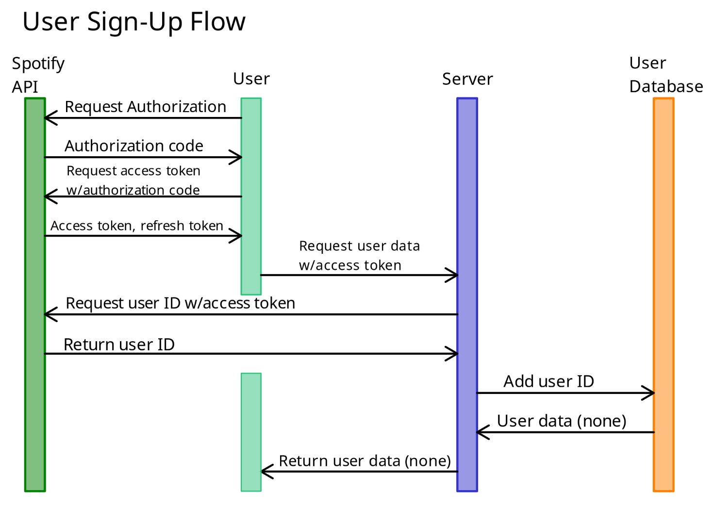
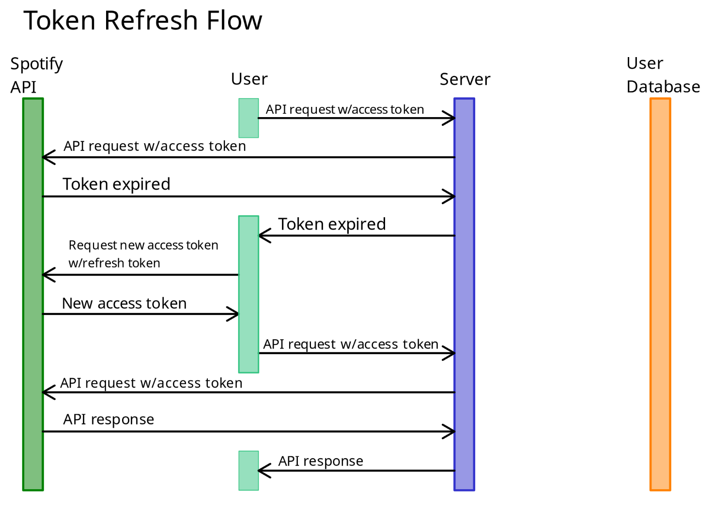
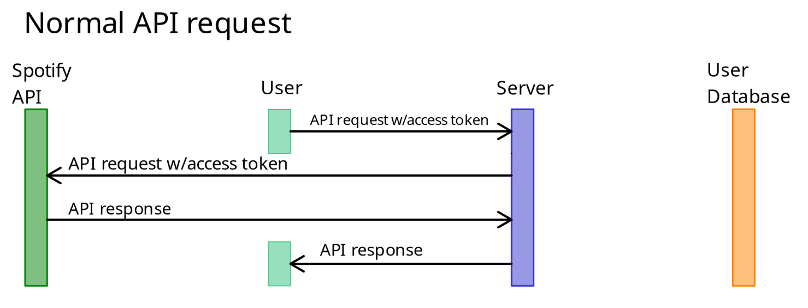

# 404Found...ers

## Access Control Sequence Diagrams

## Project Blurb
For music lovers who want to find music to fit their mood, Tune/In is an intelligent music recommendation app that suggests songs based on user emotions. Unlike traditional recommendation algorithms based on aggregate customer data, our product builds your queue based on real-time emotional analysis using facial recognition.

## UI Prototype
https://www.figma.com/design/WVzOMzZY2VJfaZEDQL6S4x/Tune%2FIn-UI-Prototype?node-id=0-1&p=f
